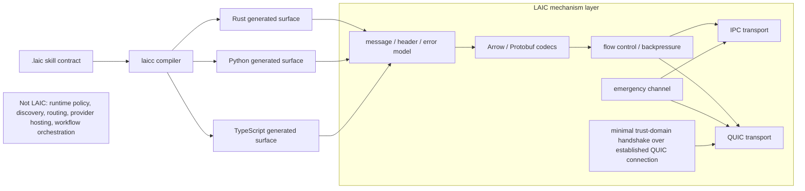

# LAIC

LAIC (Latrix AI Interconnect) is an independent mechanism-layer protocol project for high-throughput AI system communication.
It focuses on transport, contract compilation, flow control, transport security, and emergency delivery.
It does not define runtime policy, discovery, routing, provider hosting, or client convenience layers.

## Current Public Release

The current public release is `0.2.1`.
It is a patch release for `laicc` CLI diagnostics and onboarding clarity; it is not a protocol expansion or performance re-baseline.

## Mechanism Layer At A Glance

This diagram is a mechanism map, not a runtime or application architecture.
LAIC owns contract compilation, transport mechanisms, flow control, emergency delivery, and the QUIC minimal trust-domain handshake; caller-owned policy remains outside LAIC.



## Official MVP Release Artifacts

The current MVP line treats the following as official release artifacts:

- `latrix-laic` Rust package, imported as Rust crate `laic`
- `laicc` Rust crate
- `laicc` CLI

The following are not official release artifacts:

- `laicc-verify`
- tests, fixtures, CI helpers, and benchmark harnesses
- local development, planning, review, or continuity materials


The authoritative stability contract for the MVP line lives in [docs/STABILITY.md](./docs/STABILITY.md).

## Performance And Usability Evidence (0.2.0)

The published `0.2.0` line is focused on closing performance and usability validation evidence, not on widening LAIC into runtime policy, discovery, routing, provider hosting, or client SDK behavior.

For `0.2.0`, the publishing package for the mechanism-layer Rust library is `latrix-laic`; the Rust library crate name remains `laic`, so Rust code imports it as `laic`.

Current `0.2.0` evidence includes:

- the reviewed `0.1.0` MVP performance evidence remains version-marked and unchanged;
- the Windows-local IPC receive-loop optimization is recorded as bounded `0.2.0` local-transport evidence, not a new WAN/LAN authority;
- public CI and release smoke exercise packaging, the `laicc` CLI, Rust / Python / TypeScript generation, Python / TypeScript verification, contract-surface compatibility, and boundary checks.

These are release evidence lines, not production SLA claims. See [docs/PERFORMANCE.md](./docs/PERFORMANCE.md) and [docs/RELEASES.md](./docs/RELEASES.md) for the full boundaries.

## Performance Evidence (0.1.0 MVP)

The reviewed `0.1.0` MVP evidence shows LAIC's mechanism layer can carry AI-system messages with low overhead across local loopback, same-LAN QUIC, and public-WAN QUIC/mTLS test shapes.

Current measured highlights:

- Baseline local loopback evidence remains version-marked in [docs/PERFORMANCE.md](./docs/PERFORMANCE.md).
- Same-LAN QUIC p95: `580.900us` fixed-count, `2076.400us` in a 300s soak, and `1246.700us` in a 4-client fan-out.
- Public-WAN QUIC/mTLS to a cloud VM endpoint stays below `20ms` p95 across the reviewed two-host fixed-count, 300s soak, and 4-client fan-out shapes.

These are bounded `0.1.0` MVP performance evidence lines, not production SLA claims. The post-optimization Windows-local table is separately marked as `0.2.0` evidence in [docs/PERFORMANCE.md](./docs/PERFORMANCE.md).

## What LAIC Does Not Promise

The current MVP does not promise:

- runtime SDKs
- discovery or routing
- provider hosting
- session policy
- retry or reconnect convenience layers
- wider handshake/session/capability semantics beyond the current minimal trust-domain boundary

## Installation

### From This Repository

Use these commands when consuming this repository directly:

```powershell
cargo build -p latrix-laic
cargo build -p laicc
cargo install --path crates/laicc
```

### From a Published Release

For published release artifacts, the official package paths are:

```powershell
cargo add latrix-laic
cargo add laicc
cargo install laicc
```

## Quickstart From This Repository

This minimal smoke path proves the contract/codegen surface.
It does not prove any runtime SDK or provider-hosting capability.
Run commands from the repository root.

```powershell
cargo run -p laicc -- crates/laicc/tests/fixtures/echo.laic --lang rust -o .tmp/laicc-smoke
```

Expected output:

- generated file: `.tmp/laicc-smoke/echo_laic.rs`

You can switch the target language without changing the contract.
The supported `--lang` values are `rust`, `python`, and `typescript`; the default is `rust`.
For `echo.laic`, the generated file name is `echo_laic.rs`, `echo_laic.py`, or `echo_laic.ts`.

```powershell
cargo run -p laicc -- crates/laicc/tests/fixtures/echo.laic --lang python -o .tmp/laicc-smoke
cargo run -p laicc -- crates/laicc/tests/fixtures/echo.laic --lang typescript -o .tmp/laicc-smoke
```

Common CLI errors:

- `failed to read input file '<path>'`: the input `.laic` path does not exist or is not readable.
- `invalid value '<value>' for '--lang <LANG>'`: use `rust`, `python`, or `typescript`.

## Quickstart After Installing `laicc`

After `cargo install laicc`, use the installed `laicc` command with a local `.laic` file.
Create `echo.laic`:

```laic
version "1.0.0";

skill echo {
    id = "echo";

    input EchoInput {
        text: string;
    }

    output EchoOutput {
        text: string;
    }
}
```

Generate Rust bindings:

```powershell
laicc ./echo.laic --lang rust -o ./generated
```

Expected output:

- generated file: `./generated/echo_laic.rs`

The same local contract can target Python or TypeScript by changing `--lang` to `python` or `typescript`.

## Release Smoke

Run one of these from the repository root:

```powershell
powershell -ExecutionPolicy Bypass -File .\scripts\release-smoke.ps1
bash ./scripts/release-smoke.sh
```

This smoke proves only that:

- official artifacts can be packaged
- the `laicc` CLI can be invoked
- the minimal Rust / Python / TypeScript generation path succeeds

This does not prove runtime, discovery, routing, provider hosting, or client SDK behavior.

For the current MVP line, the following failures are release-blocking:

- `cargo package -p latrix-laic --allow-dirty`
- `cargo package -p laicc --allow-dirty`
- `cargo run -p laicc -- --help`
- any missing Rust / Python / TypeScript output expected by `scripts/release-smoke.*`

## Documentation Entry Points

Start with these files:

- [README.md](./README.md) for onboarding and the minimal quickstart
- [docs/BOUNDARY.md](./docs/BOUNDARY.md) for the mechanism-vs-policy boundary
- [docs/STABILITY.md](./docs/STABILITY.md) for stable vs internal/experimental surface
- [docs/PERFORMANCE.md](./docs/PERFORMANCE.md) for measured performance evidence and boundaries
- [docs/RELEASES.md](./docs/RELEASES.md) for release readiness gates
- [docs/PUBLIC_EXPORT.md](./docs/PUBLIC_EXPORT.md) for public-export boundaries
- [CHANGELOG.md](./CHANGELOG.md) for stable-surface changes

## License

LAIC is licensed under the Apache License, Version 2.0. See [LICENSE](./LICENSE).

## Scope Guard

The public boundary authority is [docs/BOUNDARY.md](./docs/BOUNDARY.md).
The practical summary is simple:

- LAIC is mechanism, not runtime policy
- the stable surface is intentionally smaller than the repository's total public visibility
- anything not listed in [docs/STABILITY.md](./docs/STABILITY.md) should be treated as internal or experimental
